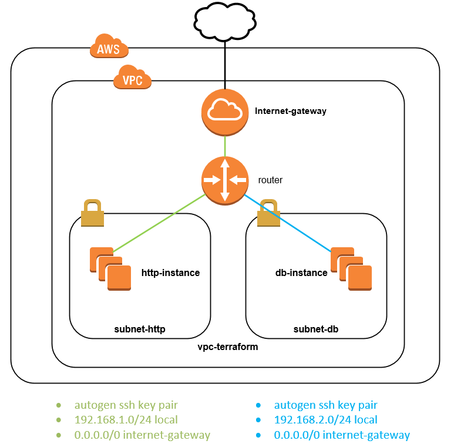

# How to



### Create stack

```
terraform apply
```

This script will create:
-   1 vpc
-   2 networks
-   2 instances http
-   3 instances db

### Delete stack

```
terraform destroy
```

FLUX

cluster
```
kind create cluster --name fluxcd --image kindest/node:v1.29.2
```

bootstrap
```
flux bootstrap github   --token-auth   --owner=inemyrovsk   --repository=webserver-ec2-module-terraform   --path=kubernetes/fluxcd/repositories/infra-repo/clusters/dev-cluster   --personal   --branch main
```

create creds
```
kubectl apply -f aws-creds.yaml
```
gitsource and terarform configs
```
kubectl apply -f gitrepository.yaml -f terraform.yaml
```

```
git commit
```

logs - troubleshoot
```
kubectl logs pod tf-app-tf-runner -n flux-system --watch
```
